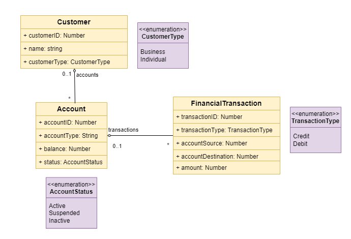

# BeAPIzer HTTP GET Query Specification
`BeAPIzer` comes with an example that shows how the framework can be used to create CRUD APIs.<br>
The following entities depicted by the UML digram below are the API resources:



<br>

In the next chapters we will explain how you can leverage `BeAPIzer` to query resources in a retrieval context (GET) to achieve:
- filtering (search with criteria) `filter`
- pagination `page` / `pagesize`
- sorting `sort`
- specific fields retrieval `fields`
- composite fields retrieval `compositekeys`


## Search Query with Criteria - Filtering

The query key `filter` is used to define any search criteria as explained below:

```js 
GET /uri?filter=criteria
```

**`criteria`** is built either as **single field criteria** or **multiple fields criteria**.

### Query with Single Field Criteria

**Single field criteria** is built according to the following structure `{entityKey: {operator1: value1, operator2: value2,....,operatorN: valueN}}`.

```js 
GET /uri?filter={entityKey: {operator1: value1, operator2: value2....,operatorN: valueN}}
```

examples:

Search with `userName` equal to `Steve`:
```js 
GET /uri?filter={"userName":{"$eq":"Steve"}}
```
Search with `createdAt` between `2024-05-01` and `1982-05-03`:
```js 
GET /uri?filter={"createdAt": {"$gte": "2024-05-01", "$lt": "1982-05-03"}}
```

Here is the list of operators along with some single field criteria examples:

| **Operator**  | **Description**                   | **Query Example** |
| :-------: | :-----------------------------|:--------- |
| **`$eq`**     | **Equal to** (==)                 | `filter={"userName":{"$eq":"Steve"}}` |
| **`$ne`**     | **Not equal to** (!=)             | `filter={"userName":{"$ne":"Steve"}}` |
| **`$gt`**     | **Greater Than** (>)              | `filter={"birthdate":{"$gt": "1994-01-01"}` |
| **`$gte`**    | **Greater Than or Equal To** (>=) | `filter={"birthdate":{"$gte": "1982-07-07"}` |
| **`$lte`**    | **Less Than** (<)                 | `filter={"balance":{"$lte": "300"}` |
| **`$lt`**     | **Less Than or Equal To** (<=)    | `filter={"balance":{"$lt": "300"}` |
| **`$regex`**  | **Like**    (~)                   | `filter={"userName":{"$regex":"Ste"}}` |
| **`$in`**     | **In** ([])                       | `filter={"userName":{"$in":["Steve","John", "Eric"]}}` |
| **`$exists`** | **Exists** (not null)             | `filter={"address": {"$exists":"true"}` |


### Query with Multiple Fields Criteria


**Multiple fields criteria** is built according to the following structure `{{$and | $or}: [simple field criteria]`.

```js 
GET /uri?filter={"$and": [{entityKey1: {operator1: value1}},{entityKey2: {operator2: value2}}]}
```

examples:

Search with `userName` equal to `Steve` AND `birthDate` >= `1994-01-01`:
```js 
GET /uri?filter={"$and": [{"userName":{"$eq":"Steve"}}, {"birthDate":{"$gte":"1994-01-01"}}]}
```

Search with `userName` equal to `Steve` OR `birthDate` >= `1994-01-01`:

```js 
GET /uri?filter={"$or": [{"userName":{"$eq":"Steve"}}, {"birthDate":{"$gte":"1994-01-01"}}]}
```

Search users having `role`  consult and `userName` equal to `John` OR `Steve`:

```js 
GET /uri?filter={"$or":[{"role":{"$regex":"consult", "$options": "i"}},{"userName":{"$in": ["Jhon", "Steve"]}}]}
```

## Query with Pagination

The query keys `page` and `pagesize` are used in the context of pagination.<br>

The key `page` defines the page to retrieve where as `pagesize` defines the number of elements retrieved by page. <br>
`BeAPIzer` allows to define a maximum page size per application using the environment variable `MAX_PAGE_SIZE`.<br>
If you specify in your http query a `pagesize` value that is greater than the maximum page size you defined for your application, then the former will take the value of the latter.

#### Example:

Here are some examples:

```js 
GET /uri?pagesize=10
```

```js 
GET /uri?page=2
```

```js 
GET /uri?page=6&pagesize=100
```

```js 
GET /uri?filter={"createdAt": {"$gte": "2024-05-01", "$lt": "1982-05-03"}}&page=3
```


## Query for a sorted result

You may want to get a set of element that are sorted based on a specific key using the query key `sort` which by default applies an ascendant order. <br>
Use `-` in order to apply a descendant order. <br>

#### Example:

Get all the entities sorted by creation date desc:
```js 
GET /uri?sort=-createdAt
```

Get all the entities sorted by creation date asc:
```js 
GET /uri?sort=createdAt
```


Get all users in the page 3 that meets the filter criteria and order them by birthdate desc and creation date asc:
```js 
GET /uri?filter={"createdAt": {"$gte": "2024-05-01", "$lt": "1982-05-03"}}&page=3&sort=-birthdate,createdAt
```


## Query and get specific fields

By default the api responds with the full list of fields in a given entity (resource).<br>
You may want to limit the informations returned by the api by selecting specific fields (keys) to be returned by the api among many.<br>
The http query key `fields` comes to meet this requirement by defining the needed keys to be returned by the api.<br>
The http query key `fields` is used as explained below:

```js 
GET /uri?fields=field1 field2 field3 field3...
```

#### Example:

Here are some examples:

```js 
GET /uri?fields=username role address
```


```js 
GET /uri?filter={"createdAt": {"$gte": "2024-05-01", "$lt": "1982-05-03"}}&page=3&sort=-birthdate,createdAt&fields=username role
```

## Query and get composite fields 

By default if a parent entity has many entities children; then when the parent is retrieved only the children identifiers will be retrieved in the api response.<br>
However sometimes we wish to get the whole child(ren) entity information along with the parent entity in the api response.<br>
The http query key `compositekeys` comes to meet this requirement by defining the composite entities to be returned by the api.<br>

#### Example:

Here are some examples:

Retrieve the user `Steve` along with all the details available for all his accounts (not only their ids):
```js 
GET /uri?filter={"userName":{"$eq":"Steve"}}&compositekeys=accounts
```


```js 
GET /uri?filter={"createdAt": {"$gte": "2024-05-01", "$lt": "1982-05-03"}}&page=3&sort=-birthdate,createdAt&fields=username role&compositekeys=accounts
```

